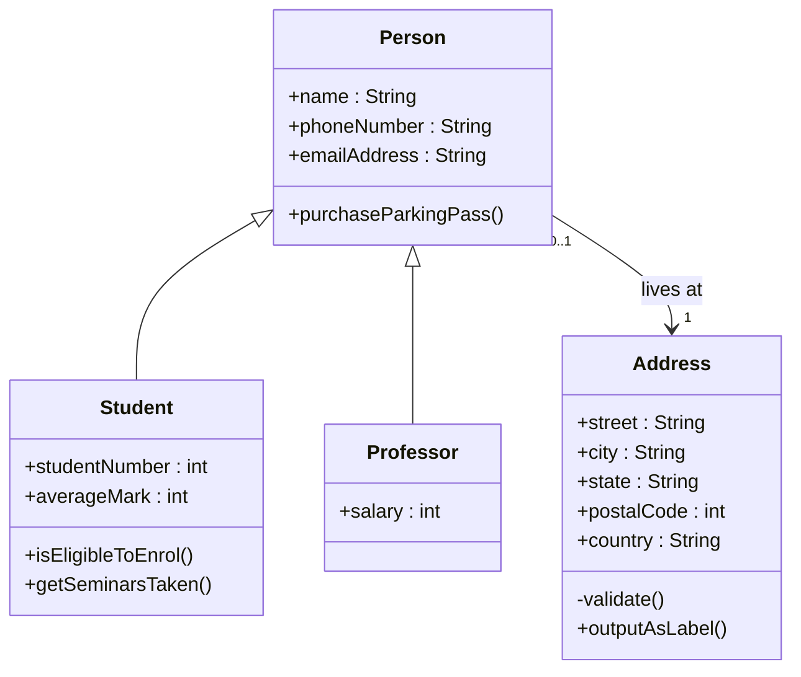

# TEMA1 - Apartado 2

# Diagrama de clases





# 7. Enlaces

Se crean con el texto entre corchetes y la URL entre paréntesis

```markdown
La empresa [OpenAI](https://openai.com) desarrolla ChatGPT

Haz click para ir a [Markdown.es](https://markdown.es/)
```

***Resultado***:

La empresa [OpenAI](https://openai.com) desarrolla ChatGPT

Haz click para ir a [Markdown.es](https://markdown.es/)

## 7.1 Enlaces automáticos
Cuando quieres ver la url completa.

```markdown
La empresa <https://openai.com> desarrolla ChatGPT

Haz click para ir a <https://markdown.es/>
```

***Resultado***:

La empresa <https://openai.com> desarrolla ChatGPT

Haz click para ir a <https://markdown.es/>

## 7.2 Enlaces por referencia

```markdown
[EnlceOpenAI]: https://openai.com

[EnlaceMarkdown.es]: https://markdown.es

La empresa [OpenAI][EnlceOpenAI] desarrolla ChatGPT

Haz click para ir a [Markdown][EnlaceMarkdown]
```

**Resultado enlces por refetrencia**:

[EnlceOpenAI]: https://openai.com

[EnlaceMarkdown]: https://markdown.es

La empresa [OpenAI][EnlceOpenAI] desarrolla ChatGPT

Haz click para ir a [Markdown][EnlaceMarkdown]

---

# 8. Imágenes

La sintaxis es similar a los enlaces, pero añadiendo `!`.  
Title de la imagen (opcional): podemos añadir un "title" a la imagen, que se verá cuando pase el ratón sobre ella añadiendo entre comillas un texto justo detrás del enlace de la imagen

```markdown


```

**Resultado**:


## 8.1 Enlaces por referencia a imágenes

Ya que al añadir imágenes también estás tratando con URLs, puedes utilizar el método que viste anteriormente para incluir links mediante referencias, solo que en este caso los enlaces de referencia serán aquellos donde se encuentre tu imagen.

```markdown
![img1]: https://upload.wikimedia.org/wikipedia/commons/d/d5/CSS3_logo_and_wordmark.svg  "Title imagen - Logo CSS3"

![img2]: img/raghavdduck-mountain-10205639.jpg  "Title - Montaña"

![Texto alternativo img1][img1]

![Texto alternativo img2][img2]
```

**Resultado enlces de imágenes**:

[img1]: https://upload.wikimedia.org/wikipedia/commons/d/d5/CSS3_logo_and_wordmark.svg  "Title imagen - Logo CSS3"

[img2]: img/raghavdduck-mountain-10205639.jpg  "Title - Montaña"

![Texto alternativo img1][img1]

![Texto alternativo img2][img2]

---

# 9. Citas

Se crean con `>`.

```markdown
> Esto es una cita.

> Un país, una civilización se puede juzgar por la forma en que trata a sus animales.  — Mahatma Gandhi

> Esto sería una cita como la que acabas de ver.
> 
> > Dentro de ella puedes anidar otra cita.
> 
> La cita principal llegaría hasta aquí. 
```

**Resultado**:

> Esto es una cita.

> Un país, una civilización se puede juzgar por la forma en que trata a sus animales.  — Mahatma Gandhi

**Resultado**:

> Esto sería una cita como la que acabas de ver.
> 
> > Dentro de ella puedes anidar otra cita.
> 
> La cita principal llegaría hasta aquí. 

---

# 10. Bloques de texto

Si quieres crear un bloque entero que contenga código. Lo único que tienes que hacer es encerrar dicho párrafo entre dos líneas formadas por tres \~ virgulillas (Alt + 126 en el teclado numérico).

```markdown
~~~
Creando códigos de bloque.
Puedes añadir tantas líneas y párrafos como quieras.  
~~~
```

**Resultado**:


~~~
Creando códigos de bloque.
Puedes añadir tantas líneas y párrafos como quieras.  
~~~

---

# 11. Código en línea

Se usa una sola comilla invertida.  
Tambiém puedes usar cuatro espacios al principio de cada línea de código (texto preformateado \<pre\>).

```markdown
El comando `print()` muestra información.

     System.out.println("Hola Mundo");
```

**Resultado**:

El comando `print()` muestra información.

     System.out.println("Hola Mundo");

---

# 12. Bloques de código

Se usan tres comillas invertidas.

````markdown
```python
print("Hola mundo")
```
````

**Resultado python**:

```python
print("Hola mundo")
```

````markdown
```json
{
  "firstName": "John",
  "lastName": "Smith",
  "age": 25
}
```
````

**Resultado json**:

```json
{
  "firstName": "John",
  "lastName": "Smith",
  "age": 25
}
```

---

# 13. Tablas

Se crean usando `|` para separar columnas.

```markdown
| Nombre | Edad | Ciudad |
|---------|------|---------|
| Ana     | 20   | Madrid  |
| Luis    | 25   | Murcia  |
```

**Resultado**:

| Nombre | Edad | Ciudad |
| ------ | ---- | ------ |
| Ana    | 20   | Madrid |
| Luis   | 25   | Murcia |

---

# 14. Líneas horizontales

Se crean con tres guiones.

```markdown
línea con guión
---
línea con asterisco
***
línea con subrayado
___
```

**Resultado**:

línea con guión

---

línea con asterisco

***

línea con subrayado

___

# 15. Listas de tareas

Muy usadas en GitHub.

```markdown
- [x] Terminar práctica
- [ ] Subir archivo
```

**Resultado**:

* [x] Terminar práctica
* [ ] Subir archivo

---

# 16. Caracteres escapados

Permiten mostrar símbolos reservados.

```markdown
\*Esto no será cursiva\*
\  barra invertida
`  acento invertido
*  asterisco
_  guión bajo
{} llaves
[] corchetes
() paréntesis
#  almohadilla
+  símbolo de suma
-  guión
.  punto
!  exclamación
```

**Resultado**:

*Esto no será cursiva*  
\\  barra invertida  
\`  acento invertido  
\*  asterisco  
\_  guión bajo  
\{\} llaves  
\[\] corchetes  
\(\) paréntesis  
\#  almohadilla  
\+  símbolo de suma  
\-  guión  
\.  punto  
\!  exclamación
---

# 17. Extensiones de Markdown personalizadas

Ver estas funciones en: [Markdown Adobe](https://experienceleague.adobe.com/es/docs/contributor/contributor-guide/writing-essentials/markdown)

## 17.1 Bloques de notas
Puede elegir entre estos tipos de bloques de notas para llamar la atención sobre un contenido específico:

[!NOTE]  
[!TIP]  
[!IMPORTANT]  
[!CAUTION]  
[!WARNING]  
[!ADMINISTRATION]  
[!AVAILABILITY]  
[!PREREQUISITES] 
[!ERROR]  
[!ADMINISTRATION]  
[!INFO]  
[!SUCCESS]  

En general, los bloques de notas deben usarse con moderación porque pueden resultar molestos. Aunque también se admiten bloques de código, imágenes, listas y vínculos, intente que los bloques de notas sean simples y directos.

```markdown 
>[!NOTE]
>
>This is a standard NOTE block.
CopyToggle Text Wrapping
```

>[!NOTE]
>
>This is a standard NOTE block.
CopyToggle Text Wrapping

```markdown
>[!TIP]
>
>This is a standard TIP.
CopyToggle Text Wrapping
```

>[!TIP]
>
>This is a standard TIP.
CopyToggle Text Wrapping

```markdown
>[!IMPORTANT]
>
>This is an IMPORTANT note.
```
>[!IMPORTANT]
>
>This is an IMPORTANT note.

Here is a simple footnote[^1].

A footnote can also have multiple lines[^2].  

You can also use words, to fit your writing style more closely[^note].

[^1]: My reference.
[^2]: Every new line should be prefixed with 2 spaces.  
  This allows you to have a footnote with multiple lines.
[^note]:
    Named footnotes will still render with numbers instead of the text but allow easier identification and linking.  
    This footnote also has been made with a different syntax using 4 spaces for new lines.
